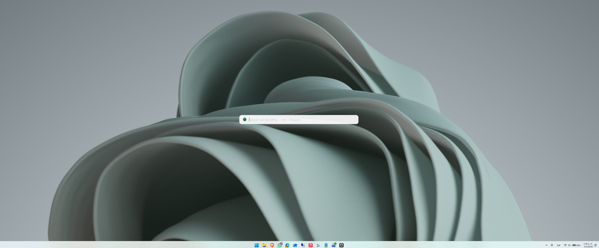

# SpotWhy

**SpotWhy** es un lanzador de aplicaciones y buscador de archivos tipo macOS Spotlight para Windows. Aparece al presionar `Ctrl + Espacio` y permite buscar y abrir aplicaciones, archivos y carpetas al instante.



---

## Caracteristicas

- Busqueda instantanea de aplicaciones (Win32 + UWP/Store), archivos y carpetas
- Activacion global con `Ctrl + Espacio` (como en macOS)
- Efecto acrilico translucido con blur nativo de Windows 10/11
- Tema automatico: se adapta al tema claro/oscuro de Windows
- Icono personalizado en la bandeja del sistema
- Tracking de apps mas usadas: las que mas abris aparecen primero
- Busqueda inteligente: soporta acronimos (vscode -> Visual Studio Code), palabras parciales y nombres sin espacios
- Barra de estado con consumo de memoria en tiempo real
- Animaciones suaves al abrir/cerrar y al expandirse los resultados
- 100% en espanol
- Modo portatil: funciona sin instalacion (ejecutar `SpotWhy.exe`)

---

## Tecnologias

| Tecnologia | Proposito |
|-----------|-----------|
| **C# / .NET 8** | Lenguaje y runtime principal |
| **WPF (Windows Presentation Foundation)** | UI nativa de Windows con aceleracion grafica |
| **Windows API (P/Invoke)** | Efecto acrilico, hotkey global, esquinas redondeadas |
| **Windows Runtime API** | Deteccion de apps UWP/Store (Calculadora, etc.) |
| **Everything SDK** | Busqueda ultrarrápida de archivos (opcional) |
| **Inno Setup 6** | Instalador profesional para Windows |
| **System.Text.Json** | Persistencia del tracking de uso |

---

## Descargas

| Archivo | Link |
|---------|------|
| **Instalador** (`SpotWhy-Setup-1.0.exe`) | [Descargar](https://github.com/dsantillanAb/Spotwhy/releases/latest) |
| **Version portatil** (`SpotWhy.exe`) | [Descargar](https://github.com/dsantillanAb/Spotwhy/releases/latest) |

> **Requisito**: Windows 10 2004+ (build 19041) con [.NET 8 Runtime](https://dotnet.microsoft.com/en-us/download/dotnet/8.0/runtime)

---

## Instalacion

### Opcion 1: Instalador (recomendado)

1. Descargar `SpotWhy-Setup-1.0.exe`
2. Ejecutarlo y seguir el wizard de instalacion
3. Al finalizar, SpotWhy se inicia automaticamente
4. Aparece un icono verde en la bandeja del sistema
5. Presionar `Ctrl + Espacio` para abrir el buscador

### Opcion 2: Portatil (sin instalacion)

1. Descargar la version portatil
2. Extraer los archivos en cualquier carpeta
3. Ejecutar `SpotWhy.exe`
4. Aparece el icono en la bandeja del sistema

---

## Como usar

| Accion | Resultado |
|--------|-----------|
| `Ctrl + Espacio` | Abre/cierra el buscador |
| Escribir texto | Busca apps, archivos y carpetas |
| `Flecha abajo` / `Flecha arriba` | Navega entre resultados |
| `Enter` | Abre el elemento seleccionado |
| `Escape` | Cierra el buscador |
| `Doble click` | Abre el elemento |
| Click fuera | Cierra automaticamente |

### Busqueda inteligente

- **"calc"** -> encuentra Calculadora, Calculator, etc.
- **"vscode"** -> encuentra Visual Studio Code
- **"chrome"** -> encuentra Google Chrome, Brave, etc.
- **"doc"** -> encuentra Documentos, Word, archivos .docx

---

## Compilar desde codigo

### Requisitos

- [.NET 8 SDK](https://dotnet.microsoft.com/en-us/download/dotnet/8.0)
- Windows 10 2004+ con Windows SDK 10.0.19041
- [Inno Setup 6](https://jrsoftware.org/isdl.php) (solo para generar instalador)

### Pasos

```bash
# Clonar
git clone https://github.com/dsantillanAb/Spotwhy.git
cd Spotwhy

# Compilar
dotnet build SpotlightWindows/SpotlightWindows.csproj -c Release

# Publicar para distribucion
dotnet publish SpotlightWindows/SpotlightWindows.csproj -c Release -o publish

# Generar instalador (requiere Inno Setup)
iscc installer.iss
```

---

## Estructura del proyecto

```
Spotwhy/
├── Spotwhy/                    # Codigo fuente
│   ├── App.xaml / .cs          # Entry point + bandeja del sistema
│   ├── MainWindow.xaml / .cs   # UI principal tipo Spotlight
│   ├── Screenshot/             # Captura de pantalla
│   ├── Models/
│   │   └── SearchResult.cs     # Modelo de datos
│   ├── Services/
│   │   ├── AcrylicService.cs   # Efecto acrilico/blur
│   │   ├── HotkeyService.cs    # Hotkey global Ctrl+Space
│   │   ├── SearchService.cs    # Busqueda de apps + archivos
│   │   ├── EverythingService.cs# Integracion con Everything SDK
│   │   ├── ThemeService.cs     # Tema claro/oscuro del sistema
│   │   └── UsageTracker.cs     # Tracking de apps mas usadas
│   └── Converters/
│       ├── TypeToColorConverter.cs    # Colores por tipo
│       └── TypeToSpanishConverter.cs  # Traduccion al espanol
├── app.ico                    # Icono de la aplicacion
├── installer.iss              # Script de Inno Setup
├── installer_output/          # Instalador compilado
├── publish/                   # Archivos publicados
├── LICENSE                    # Licencia MIT
└── README.md                  # Este archivo
```

---

## Integracion con Everything

SpotWhy soporta [Everything](https://www.voidtools.com/) de forma opcional. Si tenes Everything instalado y corriendo, SpotWhy lo detecta automaticamente y lo usa para buscar archivos al instante (mucho mas rapido que la busqueda por directorios).

No requiere configuracion: instalas Everything y SpotWhy lo usa automaticamente.

---

## Licencia

Distribuido bajo licencia MIT. Ver [LICENSE](LICENSE).

---

## Autor

**Daniel Santillan** -- [@dsantillanAb](https://github.com/dsantillanAb)
